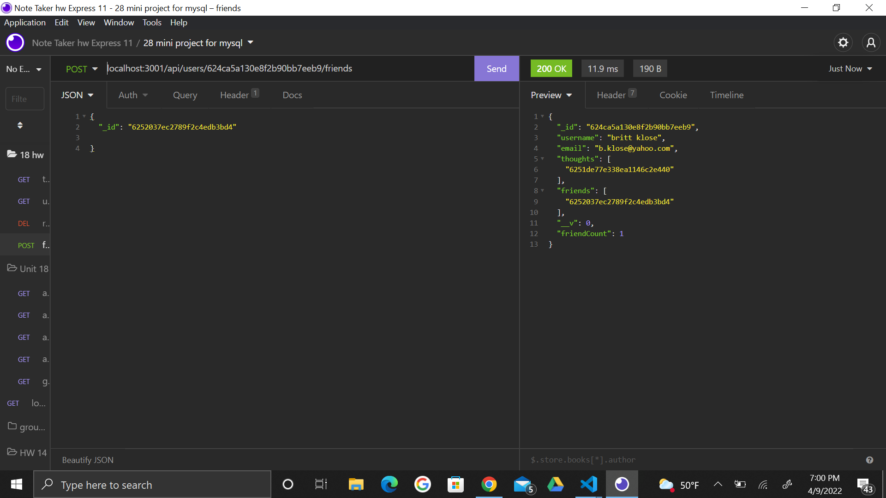
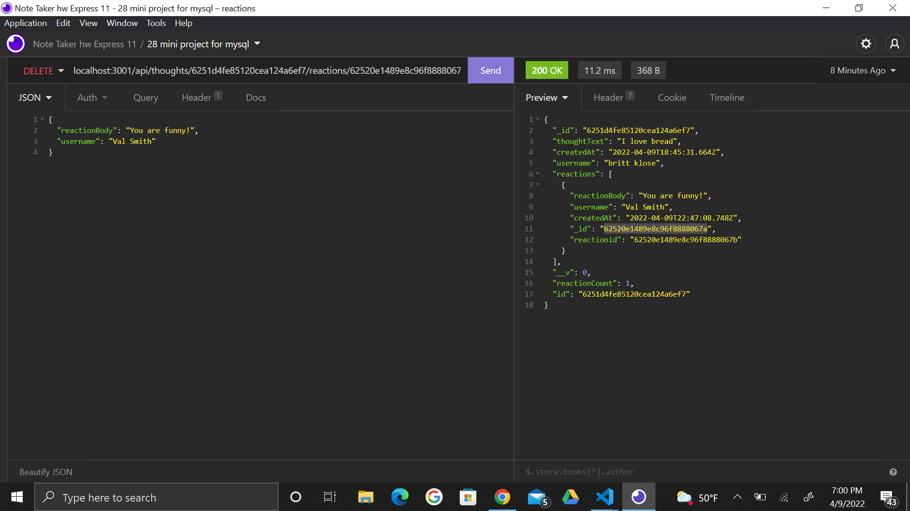

# NoSql-Social-Network

  ## Description
  This application entails an API for a social network web appliation, where each user can create an account with a username and email, post thoughts, react to others, and add friends! Take a peak to see express.js, a mongoDB database, and Mongoose ODM in action!

  ## Table of Contents

* [Installation](#installation)
* [Usage](#usage)
* [License](#license)
* [Contributing](#contributing)
* [Tests](#tests)
* [Questions](#questions)

## Installation
To install this application go through the following steps. 
1. Open or clone the repository to VSC. 
2. Run npm install so all dependencies are installed for application. 
3. In the terminal run node npm run dev or node index.js
5. Open insomnia and try out the routes. Must all start with localhost:3001/api

## Usage
In insomnica you can use GET, POST, DELETE, and UPDATE routes to transform the data. Refer to the following links to watch a demo of this application and/or the following pictures to see a visual example. 

Demo video1: https://drive.google.com/file/d/1909L42ZT_VOZjcwt8BlB1MLTNz0DBS_W/view

Demo video2: https://drive.google.com/file/d/1XO7wIdGSvZlbRr0yoZ1rzQr0k2rh5PtN/view

POST Route to add a friend to a user
 

GET Route to find all users
 

DELETE Route to remove a reaction from a thought by ID
 

PUT route to update a thought by ID
 

## License
This application uses the MIT license 

## Contributing
If you are looking to add a contribution to this project you can visit this site for information: [Contributor Covenant](https://www.contributor-covenant.org/)

## Tests
There are currently no tests to run on this application, but you can test the routes in insomnia. 

## Questions

For any additional questions or issues, you can reach out to me 
via email at brittany.klose@yahoo.com
Otheriwise fee free to further view my work on my github page at [britt-klose](https://github.com/britt-klose/).